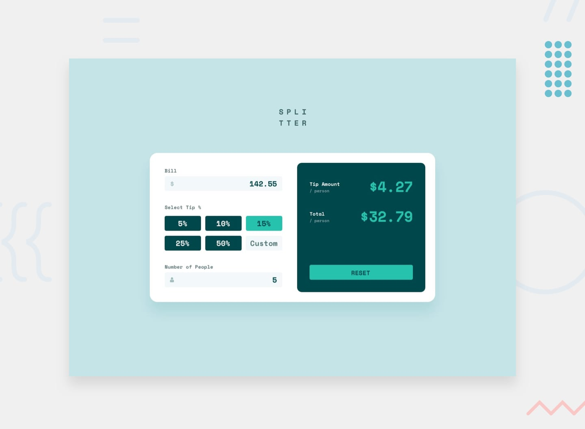

# Challenge of Frontend Mentor - Tip calculator app

## Welcome! 👋

Thank you for reviewing my project and giving your **feedback**.

## Overview

### The challenge

User should be able to:

- View the optimal layout for the site depending on their device's screen size
- Switch between viewing Daily, Weekly and Monthly stats

## My process

### Built with

- Semantich HTML5 markup
- Flexbox
- CSS Grid
- Mobile-first workflow
- JavaScript

### What was applied

#### CSS

- Setting grid-template-columns and grid-template-rows
- Positioning the banner at the botton of a card using `position: relative` and `z-index: -1`
- Using òbject-fit` to prevent images from stretching
- Using `rem` in media queries to ensure the layout stays responsive when users change their default font size
- Using `:root` variables and mixins to keep styles consistent and reusable

#### JavaScript

- Fetching data from a JSON file using the fetch() function
- Creating HTML elements dynamically with document.createElement()
- Updating and re-rendering the UI when a user clicks a time period (Daily, Weekly, Monthly)

### Continued development

I want to practice working with data more - thinks like:

- Using filter() and other array methods
- Using data attributes in HTML
- Manipulating the DOM more efficiently

### AI Collaboration

I use Claude to ask the step to implement update data then rerender

## Author

- Frontend Mentor - [@dafm10](https://www.frontendmentor.io/profile/dafm10)
